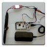

# double-rainbow-fpv

#### Double Rainbow FPV

Hi, thanks for taking a look.  This is primordial code for a bidirectional 4G FPV control/video/data link.  The RX and TX both run on Android devices, the RX connects with USB OTG to an Arduino that outputs ppm to control a normal RC model.  A goal is an affordable simple long range digital FPV link.

This is not a proper app yet, not even a beta.  Figured I would share the code to help anyone jump start similar projects (I definitely appreciate all the examples I found out there while getting this working!).

Here is a brief ground-based demo:  
http://youtu.be/94o_GtKqFVs?t=3m19s

Generally the hardware performed pretty well.  I look forward to getting this into a normal usable state as time allows.

#### Prereqs

This requires usb-serial-for-android which can also be found on github.  The android project.properties file will likely need to be adjusted to point at the relative location to which you clone usb-serial-for-android.

#### Notes

##### Its messy in here
Sorry, the code in here is beyond messy.  Especially sloppy threading which occasionally causes crashes on connection.  I've so far been laser focused on getting all the key pieces working in an end-to-end proof of concept.  I wanted to get an idea of things like how feasible a low latency video link on commodity hardware was, and how phone orientation sensors would handle vibrations.  I did get around to a few cool extras like camera zoom, external sensors, and OSD working along the way.

##### Camera crashes
The android camera api is not well documented and different devices have quirks, or do not support the hard coded resolutions, and crash.  I have been using a Motorola Razr M, and sometimes a Galaxy Nexus, and rarely a Nexus S (it works at lower resolutions but does not perform well and requires an arduino that can USB host).

##### Firmata
I plan to switch to firmata to control arduino from android.  It seems to have good community support and does everything my app does now.  I may still need to use the library version and custom code to handle ppm inputs.  Kudos to Antoine for his android apps that largely convinced me.

#### Peace
Peace out, leorleor.
