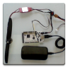

# double-rainbow-fpv

#### Double Rainbow FPV

Hi, thanks for taking a look.  This is primordial code for a bidirectional 4G FPV control/video/data link.  The RX and TX both run on Android devices, the RX connects with USB OTG to an Arduino that outputs ppm to control a normal RC model.  The goal was an affordable simple-to-use long range digital FPV link.

<!-- 
 

-->

This is an alpha release, not polished.  Figured I would share the code early on to help anyone jump start similar projects (I definitely appreciated all the examples I found out there while getting this working!).

Here is a brief ground-based demo:  
http://youtu.be/94o_GtKqFVs?t=7m20s

I did also fly it a few times and successfully used the 4G link for control and low-latency video.

Generally the hardware performed pretty well.  I look forward to getting this into a polished publishable app state if time ever allows.  Lately I've been working more on pure flying wing (nurflugel) design projects.  Please feel free to reach out about any of these topics, I'm curious to hear and see what you're working on.

#### Prereqs

This requires usb-serial-for-android library which can also be found on github.  The android project.properties file will likely need to be adjusted to point at the relative location to which you clone usb-serial-for-android.

#### Notes

##### Strengths
Some strengths of this implementation are
 - Does a lot to reduce latency for control and video streaming (eg UDP network connection with data packet checks and resyncs, multiple sockets with high priority socket for controls vs other data and video, on-the-fly adjustable video resolution and compression)
 - Recovers lost connection really well. On the 4g link. Also on the USB connection with Arduino for example in the case of RC system brownouts.
 - Serves as an example of how to use lots of phone sensors (altimeter, GPS, compass, accelerometer, camera).

##### Its messy in here
Sorry, the code in here is messy.  In particular the threading occasionally causes crashes on initial connection.  I've so far taken a quick and dirty approach to getting all the key pieces working in an end-to-end proof of concept.  I wanted to get an idea of things like how feasible a low latency video link on commodity hardware was, and how phone orientation sensors would handle vibrations.  I did get around to a few cool extras like camera zoom, external sensors, and OSD working along the way.

##### Camera crashes
The android camera api is not well documented and different devices have quirks, or do not support the hard coded resolutions, and crash.  I have been using a Motorola Razr M, and sometimes a Galaxy Nexus, and rarely a Nexus S (it works at lower resolutions but does not perform well and requires an arduino that can USB host).

##### Firmata
I plan to switch to firmata to control arduino from android.  It seems to have good community support and does everything my app does now.  I may still need to use the library version and custom code to handle ppm inputs.  Kudos to Antoine for his android apps that largely convinced me.

#### Peace
Peace, Leor
